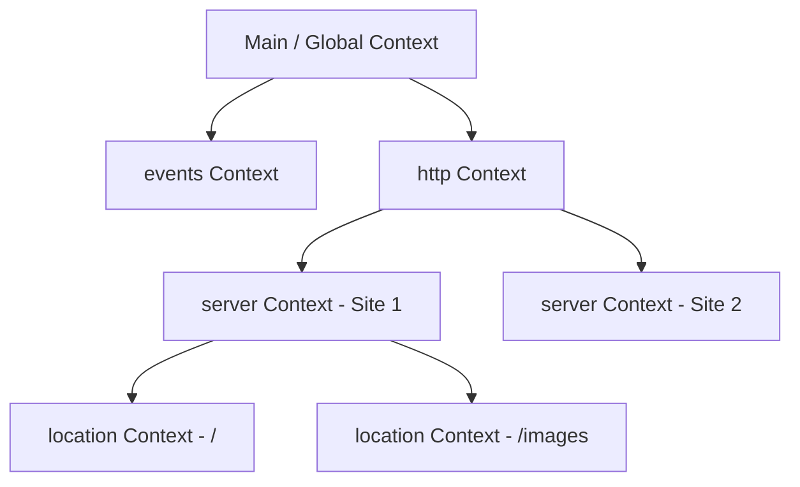

## Contexts and Directives

The Nginx configuration model is built on two concepts: **Directives** and **Contexts**.

---

## 1. Directives

Directives are the configuration options you set. They are divided into two categories:

- **Simple Directives**: Name-value pairs separated by spaces and terminated by a semicolon.
  ```nginx
  worker_processes auto;
  keepalive_timeout 65;
  ```
- **Block Directives**: Defined by a name and grouped inside curly braces `{}`. They act as contexts for other directives.
  ```nginx
  events {
      worker_connections 1024;
  }
  ```

---

## 2. Contexts (Scope)

Contexts are scopes where directives can be applied. Nginx configurations are organized hierarchically:



- **Main (Global)**: The topmost context where general configuration is defined (e.g. `worker_processes`, `pid`). It exists outside any block.
- **`events`**: Defines general connection-handling configurations (e.g., `worker_connections`).
- **`http`**: Used to group directives for web traffic (e.g., MIME types, gzip compression, logging).
- **`server`**: Nested inside `http`. Represents a virtual host or site configuration (defines port, domains, etc.).
- **`location`**: Nested inside `server`. Used to define how specific request URIs are handled (e.g. static files vs. reverse proxy routing).

---

## 3. Inheritance Rules

Nginx directives inherit down the hierarchy:
- If a directive is set in `http`, it applies to all `server` blocks within it.
- A directive set in `server` applies to all its nested `location` blocks.
- If you define a directive in a child context (e.g., `location`), it overrides the value inherited from the parent (e.g., `server`).

---

## Complete the Section

Now that you understand contexts, proceed to the next section to learn how to create and enable server blocks.
