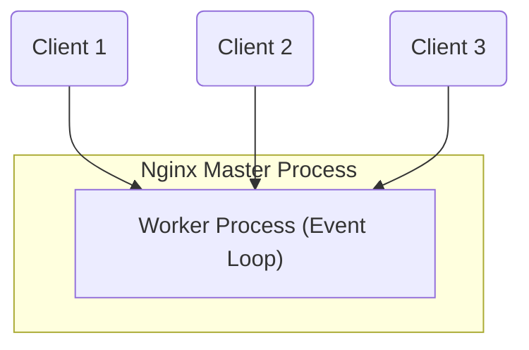

## What is Nginx?

Nginx (pronounced "engine-x") is an open-source, high-performance HTTP server, reverse proxy, load balancer, and mail proxy. Originally written by Igor Sysoev in 2002 and released publicly in 2004, Nginx was designed to solve the **C10k problem**—the challenge of handling 10,000 concurrent connections on a single server.

---

## 1. Thread-Based vs. Event-Driven Architecture

Traditional web servers, like Apache (in its default configuration), use a **thread-based** or **process-based** architecture. For every incoming connection, the server spawns a new thread or process. While simple, this approach consumes a significant amount of CPU and RAM as the number of concurrent connections grows, due to context-switching overhead and memory limits.

In contrast, Nginx uses an **asynchronous, event-driven, non-blocking architecture**:
- **Master Process**: Orchestrates the server, reads configuration files, binds to ports, and manages worker processes.
- **Worker Processes**: Single-threaded processes that handle thousands of concurrent connections using an event loop.
- **Event Loop**: Instead of waiting (blocking) for a network socket to send or receive data, a worker process registers events and handles them as they arrive. This allows a single worker to manage thousands of active requests with minimal resources.

---

## 2. Key Use Cases

While primarily a web server, Nginx is incredibly versatile:

- **Web Server**: Serves static files (HTML, CSS, JavaScript, images) extremely fast and with low memory overhead.
- **Reverse Proxy**: Sits in front of backend applications (like Node.js, Python, or Go APIs), forwarding client requests to them and returning the responses.
- **Load Balancer**: Distributes traffic across multiple backend servers to improve application availability and reliability.
- **SSL/TLS Termination**: Handles encrypting and decrypting HTTPS traffic, offloading the cryptographic workload from backend applications.
- **HTTP Cache**: Caches responses from backend servers to speed up subsequent requests.

---

## Complete the Section

This section introduces you to the core architectural principles of Nginx. Once you have read and understood these concepts, proceed to the next section to learn how the web works underneath.
