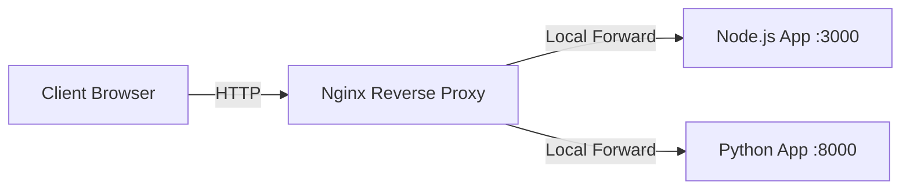

## What is a Reverse Proxy?

In modern web architectures, application servers (running Node.js, Python, Go, Java, etc.) often run on internal ports (like `3000` or `8000`) and are not exposed directly to the internet. Instead, a web server like Nginx acts as a **reverse proxy**.

---

## 1. Forward vs Reverse Proxies

- **Forward Proxy**: Sits in front of **clients** (users). It intercepts outgoing client requests and forwards them to the internet, hiding the client's identity (e.g., VPNs, corporate internet filters).
- **Reverse Proxy**: Sits in front of **backend servers**. It intercepts incoming internet requests and forwards them to one or more internal servers, hiding the identity of those servers from the client.

---

## 2. Benefits of a Reverse Proxy

- **Security**: The application servers are hidden behind the proxy, limiting their exposure to direct attacks.
- **SSL Termination**: Nginx can handle SSL/TLS decryption, reducing CPU load on backend applications.
- **Caching**: Nginx can cache static assets or application responses locally.
- **Load Balancing**: Nginx can distribute incoming traffic across multiple backend servers.

---

## Complete the Section

Once you understand the basic concept of a reverse proxy, move to the next section to configure Nginx to proxy traffic to your apps.
