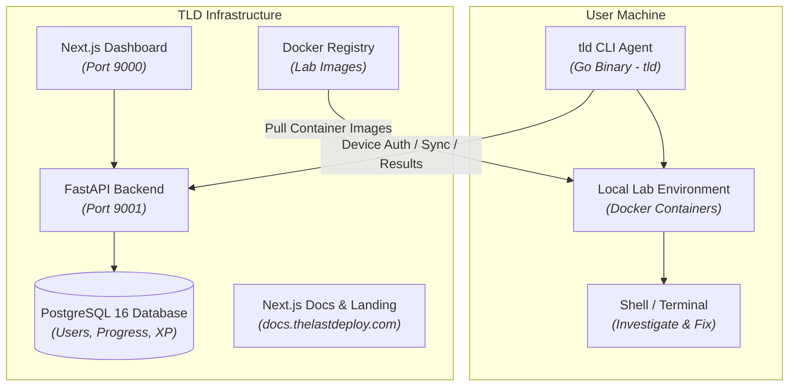

The Last Deploy (TLD) is built around a local-first execution model. Instead of provisioning multi-tenant cloud instances on AWS or GCP, TLD provisions isolated container environments on your local machine using Docker and a compiled Go CLI agent (`tld`).

## System Topology

## Subsystem Breakdown

### 1. CLI Agent (`agent/`)
Compiled Go application targeting Linux and macOS (`amd64`/`arm64`). It interacts with the local Docker daemon socket (`/var/run/docker.sock`), manages container lifecycles, unpacks lab scenario instructions to `~/.tld/labs/current/`, executes assertion scripts, and reports completion hashes to the backend API.

### 2. Backend REST API (`web/backend/`)
Python 3.12 FastAPI service backed by PostgreSQL 16 (via AsyncPG and SQLAlchemy). It handles OAuth2/JWT user authentication, CLI Device Code pairing, user XP and streak tracking, and populates curriculum records from `challenges/` using `web/backend/seed/seed_modules.py`.

### 3. Learning Dashboard (`web/frontend/`)
Next.js 16 (App Router) web application listening on port 9000. Displays the curriculum catalog, section reading materials, progress stats, global leaderboards, and an interactive CodeMirror editor for maintainers.

### 4. Documentation Site (`landing/`)
Next.js 16 application serving `docs.thelastdeploy.com` on port 9002. Renders Markdown files from `landing/docs/` with dynamic navigation configured in `landing/navigation.yaml`.

### 5. Curriculum Sources (`challenges/`)
The single source of truth for all hands-on modules. Modules contain `module.yaml`, section manifests, scenario instructions (`content.md`), and shell assertion scripts (`validator.sh`).

## Execution Trace: Starting and Checking a Lab

1. **Environment Setup:** Running `tld lab start <id>` causes the CLI agent to read module specs, issue Docker API calls to pull necessary images, build a dedicated bridge network (`tld-net-<id>`), and unpack the scenario README into `~/.tld/labs/current/README.md`.
2. **Local Debugging:** You investigate and resolve the issue directly inside your local terminal shell using native binaries (`docker`, `curl`, `netstat`, `systemctl`, text editors).
3. **Programmatic Assertion:** Running `tld check` executes `validator.sh` inside the lab environment context. If all assertion steps pass (exit code 0), the CLI posts the completion payload to `POST /api/v1/results/check` to credit your account with XP.